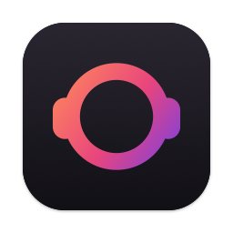
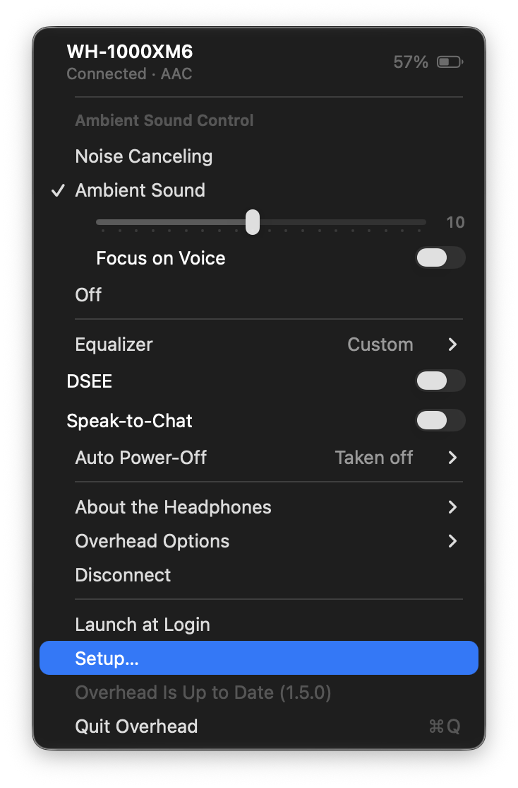
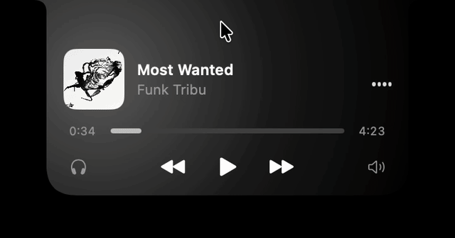
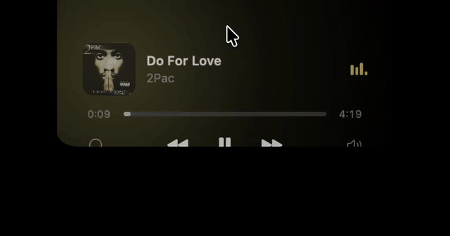

<p align="center"></p>

# Overhead

Control your Sony headphones from your Mac, right from the menu bar and the notch. No phone app needed.

Overhead switches noise cancelling and ambient sound, sets the equalizer and shows the battery of your Sony
Bluetooth headphones. It also turns the MacBook notch into a small player for the music playing in Spotify,
Apple Music, and (experimental) Deezer, YouTube Music or your browser.

The notch player stands on its own: no Sony headphones, no Bluetooth, no account. Any MacBook with a notch will
do, and on a screen without one it shows up as a black pill at the top.

<p align="center"></p>

## Install

### With Homebrew

If you use [Homebrew](https://brew.sh), run:

```sh
brew install --cask flotttt/tap/overhead
```

Then open Overhead from your Applications folder. The first time, macOS says it can't check the app, because
it isn't signed with an Apple developer account yet: click Done, then go to System Settings › Privacy &
Security, scroll down and click **Open Anyway**. Homebrew doesn't skip that step.

### Without Homebrew

1. Download **Overhead.zip** from the [latest release](https://github.com/flotttt/Overhead/releases/latest)
2. Open the zip and drag **Overhead** into your Applications folder
3. Open Overhead. The first time, macOS says it can't check the app because it isn't signed with an Apple
   developer account yet. Click Done, then go to System Settings › Privacy & Security, scroll down and click
   **Open Anyway**

### First launch

Overhead appears in the menu bar and opens its setup window. First choose how you want to use it:

- **Notch**: your music in the notch, no Sony headphones needed. Bluetooth is never used.
- **Headphones**: your Sony headphones' settings in the menu bar, without the notch.
- **Both**: the notch and the headphones together.

The window then checks what that choice needs, with a button for each: Bluetooth access, your headphones,
permission to control Spotify and Music, and launch at login. Pair your headphones in System Settings › Bluetooth first if they aren't yet.

If something stops working later, open the same window with Setup… in the menu: every line can be fixed or
redone from there.

Works on macOS 13 or later, on Apple Silicon and Intel Macs.

## Update

Overhead checks once a day for a new version. When one is out, click **Update to Overhead** in its menu: it
downloads the new version, replaces itself and restarts. When you're up to date, the item is greyed out. Your
settings and the Bluetooth and music app permissions are kept. Coming from version 1.2.1 or older, macOS asks for
the permissions one last time.

With Homebrew you can also run `brew upgrade --cask overhead`.

Overhead was called SonyNotch until version 1.4. SonyNotch's update installs Overhead in its place, with your
settings and permissions: nothing to do. With Homebrew, switch casks once: `brew uninstall --cask sonynotch`, then
`brew install --cask flotttt/tap/overhead`.

## Uninstall

If you turned on Launch at Login in the menu, turn it off first. Then run `brew uninstall --cask overhead`, or quit
Overhead and move it to the Trash.

## What it does

### Menu bar

<p align="center"></p>

Click the headphones icon in the menu bar to:

- switch between Noise Cancelling, Ambient Sound and Off, and set the ambient level and Focus on Voice
- pick an equalizer preset or make your own (read only on the WH-1000XM6 for now)
- turn DSEE, Speak-to-Chat and Adaptive Volume on or off, and set Auto Power-Off, when your model has them
- see the battery level, for each earbud and the case on true wireless models
- see the firmware, codec and Bluetooth address in About the Headphones

The icon shows the current sound mode and follows the NC button on your headphones. Overhead connects on its
own when the headphones join the Mac, reconnects if the link drops, and can launch at login. It's available in
English and French.

### Notch

Move the pointer over the notch and it opens into a player with:

- the artwork, title and artist (click the artwork to bring the player to the front)
- a progress bar you can click or drag
- previous, play/pause and next
- a volume button for the player's volume
- a headphones button to change the sound mode without opening the menu

Behind the player, a soft glow takes the colour of the artwork.

<p align="center">
  
  
</p>

When the notch is closed, it shows the album artwork, circled by a ring that fills up as the track plays, and
little bars that move with the music. Hover the bars to skip to the next track, or to resume the music when it's
paused. When the track changes, the artwork flips over, backwards when you go to the previous track.

When the music is paused or stopped, the closed notch shows the headphones' battery instead, as a ring with the
percentage, orange when low, red when almost empty and green while charging. Without music, the sound mode
shows on the other side.

With the pointer over the notch, you can also use the trackpad:

- swipe right with two fingers for the next track, left for the previous one
- scroll up or down to change the player's volume, the volume bar shows up while you do

The trackpad gives a light tap when the notch opens, when you press a button, skip a track or pass every ten
percent of volume.

Everything can be adjusted in Overhead Options:

- Notch Size: width and height, the size of the closed notch, the artwork and the text, with a live preview
- Notch Gestures: turn each gesture and each kind of tap on or off, reverse the gestures and set how strong
  the taps are
- Glow: turn the glow off or change its size, with a live preview
- Progress Ring and Headphones Battery: show or hide them on the closed notch
- Show Notch: turn the notch off completely
- Other Players (Experimental): follow Deezer, YouTube Music, your browser… too

The player works with the Spotify and Music apps for Mac, without any account or login. When both are open, it
follows the one playing, the last one started if both are.

With Other Players (Experimental), on by default, the notch also follows any app that shows up in macOS's Now
Playing: Deezer, YouTube Music, a video in your browser… It reads it through the perl that comes with macOS,
since macOS 15.4 only lets Apple's own programs read Now Playing. The volume button is greyed out for these
players, as Now Playing gives no volume. If a macOS update breaks it, only these players stop working. On a screen without a notch, it
shows up as a black pill at the top of the screen.

## Supported headphones

| | Models |
|---|---|
| Tested | WH-1000XM6, WH-CH720N, ULT WEAR (WH-ULT900N) |
| Should work | WH-1000XM5, WH-XB910N, WH-CH520 |
| Earbuds, controls work but battery may not | WF-1000XM4, WF-1000XM5, WF-C700N, LinkBuds S |
| Older models, sound modes only | WH-1000XM4, WH-1000XM3, WH-1000XM2, WH-XB900N, MDR-XB950BT |

If you try a model that isn't tested, please [open an issue](https://github.com/flotttt/Overhead/issues/new)
and say how it went.

## Troubleshooting

**macOS won't open the app.** Go to System Settings › Privacy & Security and click Open Anyway, as in the
install steps.

**The headphones aren't found.** Connect them in System Settings › Bluetooth, then click Connect in the
Overhead menu.

**Nothing happens after opening the app.** Check that Overhead is allowed in System Settings › Privacy &
Security › Bluetooth.

**The notch says Overhead isn't allowed to control Spotify (or Music).** Click Open Settings and turn on the app
under Automation › Overhead.

**The menu bar icon is missing.** When the menu bar is full, macOS hides icons behind the notch. Quit or hide a
few other menu bar apps.

**The controls stopped responding.** Click Disconnect then Connect in the menu, or turn the headphones off and
on.

## For developers

### Build from source

You need Apple's Command Line Tools (`xcode-select --install`). The full Xcode app isn't required.

```sh
git clone https://github.com/flotttt/Overhead.git
cd Overhead
make install      # build and install to Applications
make run          # build and launch, add DEBUG=1 to log the Bluetooth traffic
make test         # unit tests and translation check
make release      # universal build zipped in build/Overhead.zip
```

Logs go to `~/Library/Logs/Overhead/app.log`. Launch the app with `open`, Finder or `make`, not by running the
binary inside the bundle, or macOS closes it when it first uses Bluetooth.

The app is written in Swift with AppKit and SwiftUI, on top of a C++ core for the headphones protocol. The code
is in `Client/`, and the notch is in `Client/macos/Notch` and `Client/macos/Music`.

### How it talks to the headphones

Sony headphones expose a Bluetooth serial (RFCOMM) service and accept small binary frames:

```
<0x3e> escaped( type, sequence, 4-byte length, payload, checksum ) <0x3c>
```

Headphones up to the WH-1000XM4 use a first version of this protocol, newer ones use a second. Overhead
detects which one when it connects. The byte layouts were checked against the Sony support in
[Gadgetbridge](https://codeberg.org/Freeyourgadget/Gadgetbridge).

For the notch, Spotify and Music post a system notification on every playback change, and Overhead asks the
app for the details, artwork and volume with AppleScript. Nothing is polled while the notch is closed.

## Origins

Overhead started as a fork of [AmitRajput-Dev/SonyBridge](https://github.com/AmitRajput-Dev/SonyBridge),
which builds on [SonyHeadphonesClient](https://github.com/Plutoberth/SonyHeadphonesClient) by Plutoberth,
semvis123 and their contributors. It has since been renamed and largely rewritten.

Overhead isn't affiliated with or endorsed by Sony. It uses a reverse engineered protocol, so use it at your
own risk.

## License

MIT, see [LICENSE](LICENSE). The original copyright notice is kept as the license requires.
